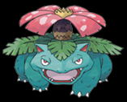
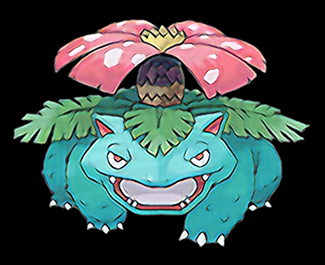
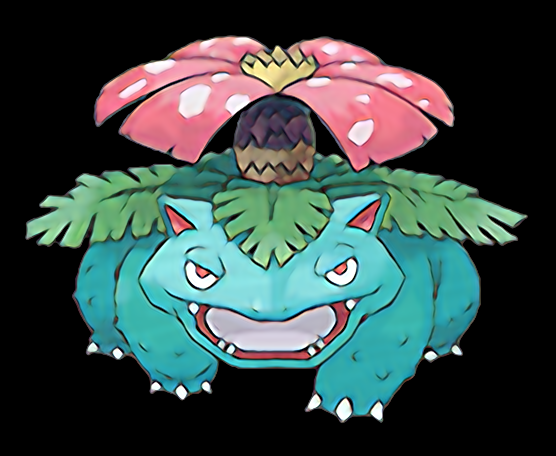
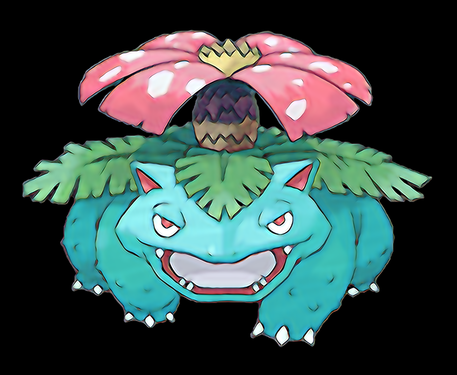

# Super-Resolution Pokemons with CNN

Neural network to improve image quality.

We followed the intuition of [SRCNN (Super-Resolution CNN) algorithm](https://arxiv.org/pdf/1501.00092) to upscale Pokemon images.

Nevertheless, we adapt convolutional filters number and size to our target.

Pokedex images can be downloaded [here](https://www.pokebip.com/download/pokedex_offline_2.0.3_avec_images.zip).

## Example

### `ID 003: Venusaur`

Initial image (`157 x 127` pixels):

Upscaled image x2 (`367 x 300`):

Upscaled image x3.5 (`556 x 456`):

Upscaled image x5.6 (`891 x 731`):

## Training time

Between 3 to 10 minutes for 20 epochs with `Intel® Core™ i7-8850H CPU @ 2.60GHz × 12`

Of course, it depends on the number of layers. Nevertheless, this network can be trained on a regular laptop.

# How to run?

## Dependencies

First, install dependencies with:

`pip install -r requirements.txt`

We use `tensorflow` and `opencv`.

## Run

The repository can be run without training any network as an already trained network is provided in the `NN/` folder.

## Files description

- `network.py`: Neural network class definition
- `train.py`: Script to launch to train the network
- `infer.py`: Script to run to use a trained neural network
- `tools.py`: Function to load / process data
- `extract_readme_images.py`: Use a neural network to generate different image variations from a single image
-

# Recommendations

- When upscaling, use a scale factor which is can be written as `k/2` or `k/4`
- Even if the base model is trained with an upscaling factor of `f=2`, it can be preferable to upscale with `f=1.5` several times
- Avoid large upscaling (e.g., when a model learned an upscaling of `2`, avoid upscaling with `4`, as learned kernels cannot find enough info)
- Passing twice the image through the model (without upscaling) can improbe the sharpness
- Avoid passing the image too many times within the model, as colors tend to change

## Recommandation

**TODO**

Show differences between F3 L1 VS F1.75 L2

# TODO

- [ ] Small pixel images:
    - Tested: interpolation with `cv.INTER_NEAREST` to keep a pixel-like image.
    - Problem: Images are too small, and the network struggle to identify patterns / informations
- [ ] Background removal / Alpha mask handling.
    - Tested idea: upscale normally. Problem: blurry border
    - To test: Train a NN to upscale the alpha layer.
- [ ] Illustrate recommendations
