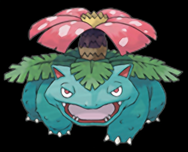
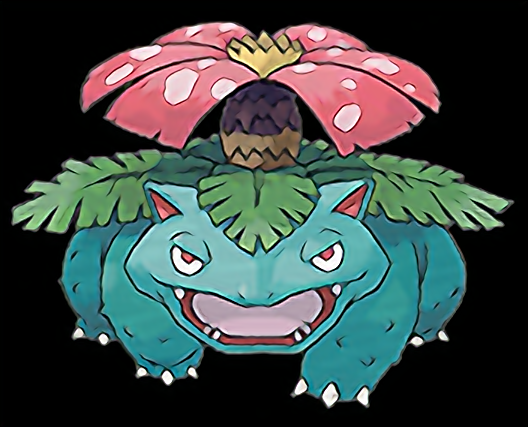
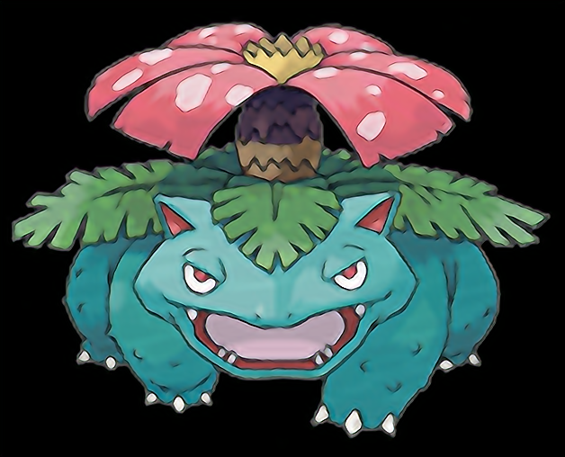
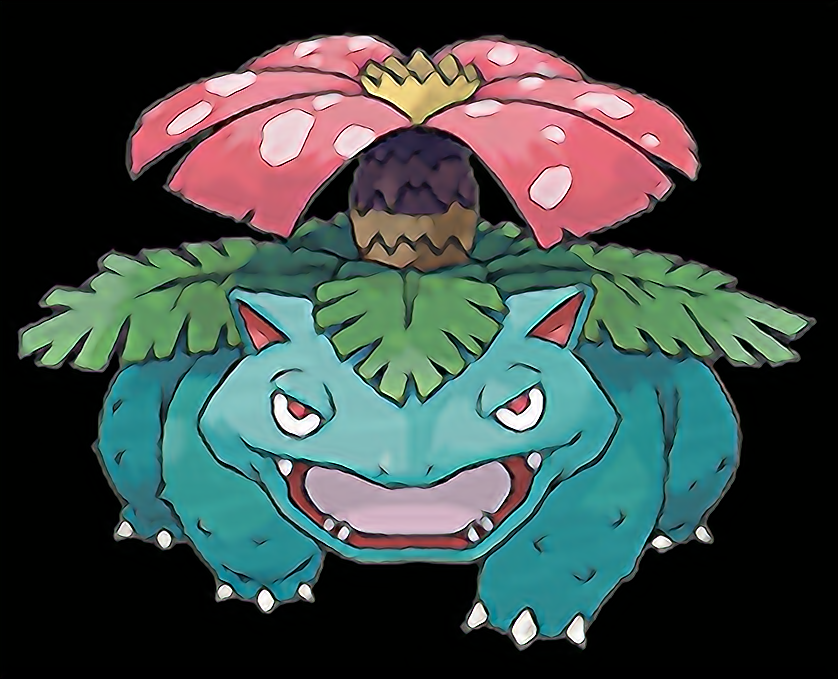

# Super-Resolution Pokemons with CNN

Neural network implementation to improve image quality.

We implemented two neural networks architectures to upscale Pokemon images:

- [SRCNN (Super-Resolution CNN) algorithm](https://arxiv.org/pdf/1501.00092)
- [VDSR (Very Deep Convolution Network)](https://openaccess.thecvf.com/content_cvpr_2016/papers/Kim_Accurate_Image_Super-Resolution_CVPR_2016_paper.pdf)

Pokemon images contains much less details than in a "natural" image.
Therefore, we adapt the architecture to the current case.

Also, we use separable convolution, which reduces the size of the network (by 10 in our configuration), and fasten the training.

## Dataset

Pokedex images can be downloaded [here](https://www.pokebip.com/download/pokedex_offline_2.0.3_avec_images.zip).

## How it works?

### Inference Process

1. You have an image of size `a x b`
2. You upscale it as `a*f x b*f`. This one is blurry. `f` can be an integer (`2`) or a floating value (reco.: `1.5`, 1.75`)
3. You feed the blurry image to the network
4. The network outputs a denoised image

### Training Process

1. Take your images (this is the `Y`)
2. Downscale the images
3. Rescale them to the original size (they are blurry, this is your `X`)
4. Train the network to learn `X -> Y`

*Note*: Here, the network learns to upscale images **without** having access to **high resolution images**.

## Example

### `ID 003: Venusaur`

Initial image (`157 x 127` pixels):

Upscaled image x2 (`314 x 254`):

Upscaled image x3.5 (`528 x 427`):

Upscaled image x4 (`628 x 508`):

Upscaled image x5.3 (`838 x 679`):

## Training time

We need around 10 minutes for 20 epochs with `Intel® Core™ i7-8850H CPU @ 2.60GHz × 12`

Of course, it depends on the number of layers. Nevertheless, this network can be trained on a regular laptop.

# How to run?

## Dependencies

First, install dependencies with:

`pip install -r requirements.txt`

We use `tensorflow` and `opencv`.

## Training

To train the SRCNN:

`python3 train.py ./dataset/sugimori/  --n_epochs=20 SRCNN --nn_filters 32 32 32 --nn_kernels 7 5 3 1`

To train the VDSR:

`python3 train.py ./dataset/sugimori/  --n_epochs=10 VDSR --nn_filters 32 32 32 --nn_kernels 7 5 3 1`

By default, we use separable convolution.
To turn on normal convolution, use the `--conv=conv2D` flag (before the network keyword).

(If you do not want to train the network, we provide already trained network ready to use in the `NN/` folder)

*Note*: Because VDSR use residual connections, it is much faster to train than the SRCNN.

Best loss so far:

| Network  | SRCNN   | VDSR    |
|----------|---------|---------|
| MSE      | 0.0026  | 0.0019  |
| Epochs   |  10     | 6       |
| Archi    |  `n32k7_n32k5_n32k3_n3k1`       | `n5 f32` |

## Run

They can be used to generate the `readme` images (try several scaling factor + Loop several times)

`python3 extract_readme_images.py "./NN/VDSR_n5_f32_sugimori_E10.keras" ./dataset/sugimori/5.png`

### Network customization

The network is made of `k+1` layers, the last one reconstructing the final image.

To customize the network, you have two main parameters:

- the number of filters (`--nn_filters` param)
- the size of the filters (`--nn_kernerls` param)

You can customize the `k` first layers as you which. However, for the last one, as we want an RGB image, we need exactly `3` filters, so you do not have to specify it.
Therefore, you need to specify `k` number of filters and `k+1` kernels width (Yet, it is recommended to have a small kernel size for the last layer to avoid "patch effect").

*Note*: the sum of the convolutional kernel size should be odd. Otherwise, the transformed image and expected image cannot be aligned.

### Patch size

When the layers have been specified, you may play on the `patch_size`.
The dataset images do not have the same size. Therefore, instead of training on the full image, the network is trained on patches (images cropped at random).

Because convolutional layers are applied without padding, the image "shrink" one step after the other.
When selecting the patch size, verify that the number of resulting pixels is sufficient.

## Files description

- `network.py`: Neural network class definition
- `train.py`: Script to launch to train the network
- `infer.py`: Script to run to use a trained neural network
- `tools.py`: Function to load / process data
- `extract_readme_images.py`: Use a neural network to generate different image variations from a single image

# Recommendations

- When upscaling, use a scale factor which is can be written as `k/2` or `k/4`
- Even if the base model is trained with an upscaling factor of `f=2`, it can be preferable to upscale with `f=1.5` several times
- Avoid large upscaling (e.g., when a model learned an upscaling of `2`, avoid upscaling with `4`, as learned kernels cannot find enough info)
- Passing twice the image through the model (without upscaling) can improbe the sharpness
- Avoid passing the image too many times within the model, as colors tend to change

## Recommandation

**TODO**

Show differences between F3 L1 VS F1.75 L2

# TODO

- [ ] Implement SSIM and PSNR to evaluate the algorithm, as MSE loss is not enough.
- [ ] Small pixel images:
    - Tested: interpolation with `cv.INTER_NEAREST` to keep a pixel-like image.
    - Problem: Images are too small, and the network struggle to identify patterns / informations
- [ ] Background removal / Alpha mask handling.
    - Tested idea: upscale normally. Problem: blurry border
    - To test: Train a NN to upscale the alpha layer.
- [ ] Illustrate recommendations
- [ ] OS agnostic. Change the `/` by `os.path.join`
